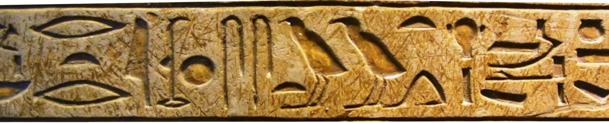
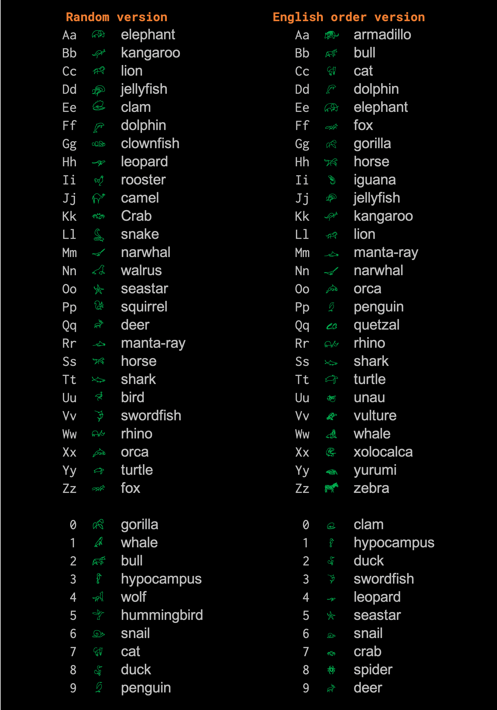

# Crypto animal font

**BE LIKE A CRYPTOLOGIST!**

This font becomes alphabet characters into symbols.
Easy to use and funny for kids and school projects.

The english ordered version uses animals matching the first letter of their name.

### Happy encoding!

### Preview

Tags: Crypto, funny, animals, font, kids, school

## How to install?

Download versions here 👉 [Versions](./dist)

### Windows

1. Open the Windows Control Panel.
2. Select Appearance and Personalization.
3. At the bottom, select Fonts. ...
4. To add a font, simply drag the font file into the font window.
5. To remove fonts, just right click the chosen font and select Delete.
6. Click Yes when prompted.

### Mac OSX

Double-click the font in the Finder, then click Install Font in the font preview window that opens. After your Mac validates the font and opens the Font Book app, the font is installed and available for use.

### Linux
In your file manager double-click the font, then click Install in the font preview window that opens. You need to close all instances of e.g. libre office and reopen them, to see the new font.

## Status

Project is: _in progress_
Thank you for using this font

## TODO

- Add more symbols
- Build a Spanish ordered version

## Stay in touch

- Author - Luis Arias 2020 <ariassd@gmail.com> - [GitHub profile](https://github.com/ariassd)

## License

This font is free for personal and commercial use. You are free to copy and transmit this typeface.

This typeface is licensed under Creative Commons CC BY-ND, Version 3.0

[Creative Commons Attribution 4.0 International License](http://creativecommons.org/licenses/by/4.0/)

November 2020
